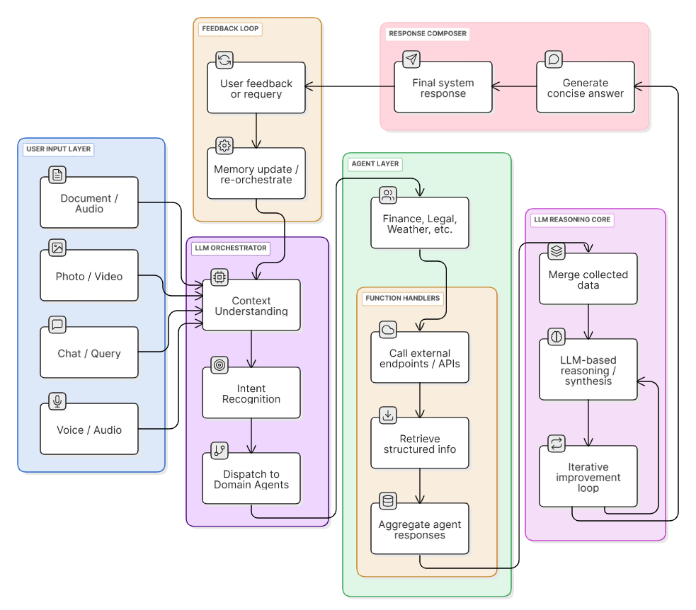

# 🧠 Cognifix – Multimodal Multi-Agent Orchestrator

Cognifix is a **multimodal, multi-agent orchestrator** built in **Kotlin (Jetpack Compose)** that seamlessly handles **text, voice, image, audio, video, and file inputs** — routing them intelligently across specialized agents such as **Finance, Travel, Research, Design, Repair, and more**.  
It uniquely combines **agentic reasoning** with **function-calling orchestration**, integrating APIs like **Financial Modeling Prep**, **Serper Search**, and **OpenWeather**, while using **Gemini models** for reasoning and tool invocation.

---

## 🎨 UI Walkthrough
> Explore the Cognifix Chat interface designed for multimodal interactions.

---

## 🤝 Agent Interaction
> Multi-agent communication and orchestration flow inside Cognifix.

---

## ⚙️ Technical Architecture

### 🔹 Core Concept
Cognifix acts as a **meta-orchestrator** — routing each user request to the most relevant **Agent** or combination of agents using natural-language intent detection.  
Agents like *FinanceAgent*, *TravelAgent*, *RepairAgent*, and *NanoBanana (Image Annotator)* specialize in their own API domains or reasoning roles.

### 🔹 Multi-Agent Flow

1. **User Input (Multimodal)**  
   Text, image, audio, or video input enters the system through `ChatPage.kt`.
2. **Intent Detection**  
   `IntentDetector.kt` decides whether to invoke **Gemini (LLM)** or **NanoBanana (ImageAnnotator)** for visual reasoning.
3. **Routing Logic**  
   `AgentRouter.kt` classifies which domain agent (Finance, Research, Travel, etc.) should handle the query.
4. **System Prompt & Tools**  
   Each agent has its own **system prompt** and linked **function declarations** (`FunctionDeclaration.kt`).
5. **LLM Orchestration**  
   `ChatAgent.kt` acts as the orchestrator, sending structured multimodal inputs to **Gemini API** and handling **tool calls** dynamically via `FunctionHandlers.kt`.
6. **API & Tool Handling**  
   APIs like:
   - 🪙 `fetchStockData()` – Financial Modeling Prep  
   - 🌦️ `fetchWeather()` – OpenWeather API  
   - 🌍 `fetchWebSearchResults()` – Serper.dev (Google Search)  
   - 💱 `fetchExchangeRate()` – Forex from FMP  
   - ✈️ `fetchFlights()` – Search-based route finder  
   are defined and executed through `FunctionHandlers.kt`.
7. **Response Aggregation**  
   All agents’ outputs are aggregated and formatted by `ChatAgent.kt` before displaying in `ChatPage.kt`.

---

## 🧩 File Breakdown

| File | Role |
|------|------|
| **MainActivity.kt** | App entry point |
| **ChatPage.kt** | UI logic for chat screen, multimodal input, attachments, and streaming output |
| **ChatAgent.kt** | Orchestrator that manages agent reasoning, LLM calls, and tool executions |
| **AgentRouter.kt** | Classifies input into correct domain-specific agent |
| **FunctionHandlers.kt** | Executes external API or function calls from Gemini |
| **FunctionDeclaration.kt** | Defines schema for all registered tools |
| **ImageAnnotator.kt** | Handles NanoBanana image reasoning and annotation |
| **IntentDetector.kt** | Detects visual intent (image editing, object fixes) vs textual reasoning |
| **ChatModels.kt** | Data models for chat messages and chat items (Text, Image, Audio, etc.) |

---

## 🧠 Why Cognifix is Unique

- **Multimodal Understanding:** Text + Image + Audio inputs handled simultaneously.  
- **Dynamic Agent Switching:** Multiple agents can collaborate under one orchestration cycle.  
- **Context Preservation:** Memory reset control with *New Chat* button for stateless or contextual flow.  
- **Seamless API Orchestration:** Combines reasoning and external data-fetching intelligently.  
- **Visual Intelligence (NanoBanana):** Enables on-image annotation and correction reasoning.  
 

---

## 🧑‍💻 Built With

- **Language:** Kotlin  
- **Framework:** Jetpack Compose  
- **Backend Model:** Gemini API  
- **Architecture:** Multimodal Orchestrated Agent System  
- **APIs Integrated:** OpenWeather, Financial Modeling Prep, Serper.dev Search, NanoBanana Image Annotator  

---

> ✨ *“Cognifix brings harmony to chaos — bridging vision, reasoning, and interaction through a symphony of intelligent agents.”*
