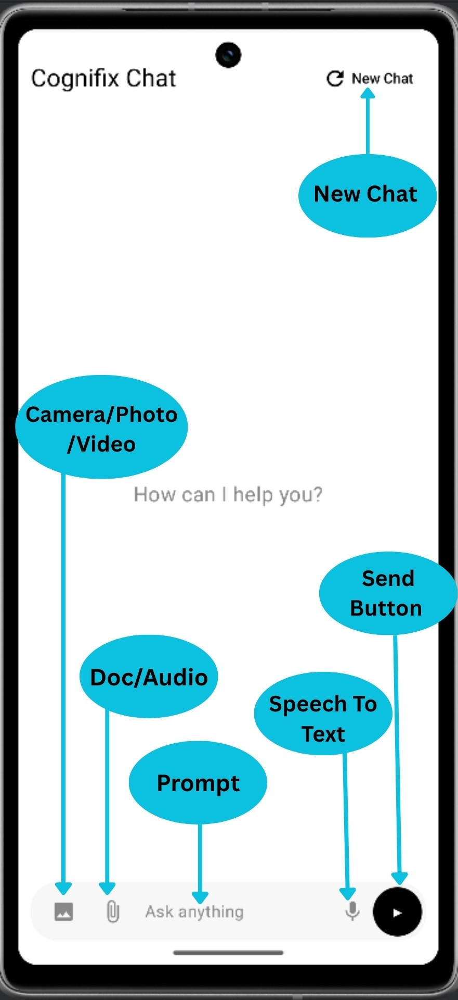

# Cognifix: Multimodal Multi-Agent Orchestrator

## Introduction

**Cognifix** is a multimodal, multi-agent orchestrator built in **Kotlin** that integrates **visual**, **textual**, and **auditory** modalities within a unified conversational framework.  
It leverages **Gemini models** for text and multimodal reasoning, orchestrating multiple specialized agents (Finance, Travel, Repair, Research, etc.) to respond intelligently across domains.  
Cognifix is unique in its **modular orchestration pipeline** — the system dynamically detects intent, selects relevant agents, invokes domain-specific APIs, and composes unified multimodal outputs, all in real-time.

Unlike conventional chat applications, Cognifix merges perception and reasoning: images, text, and voice inputs flow into an orchestrator that coordinates specialized agents, enabling contextual, knowledge-rich, and multimodal reasoning.

---

## UI Walkthrough

The Cognifix user interface provides a minimal yet powerful multimodal chat experience, integrating:
- Real-time text and voice input.
- Image, video, and file attachments.
- Visual annotations through NanoBanana (ImageAnnotator).
- Adaptive agent routing based on input context.

Below is an example of the **UI walkthrough** illustrating how a user interacts with the chat system:



---

## Agent Interaction

The orchestrator dynamically routes each query to one or multiple specialized agents.  
Agents collaborate by invoking the correct API, reasoning module, or multimodal handler. The orchestrator aggregates their responses into a cohesive conversational output.

Example interaction between multiple agents:
- **Travel Agent** retrieves live data using `fetchFlights` and `fetchWebSearchResults`.
- **Finance Agent** provides currency exchange rates and stock data through `fetchStockData` and `fetchExchangeRate`.
- **Research Agent** summarizes related information via Serper.dev web search.
- **NanoBanana (ImageAnnotator)** visually analyzes or enhances user-uploaded images.


---

## Technical Architecture

### Core System Overview

Cognifix follows an **agentic pipeline architecture** with the following flow:

1. **Multimodal Input Layer**  
   Handles text, audio, image, and video inputs. Extracted data from these modalities is passed downstream to the orchestrator.
   
2. **Intent Detection Layer**  
   Implemented via `IntentDetector.kt`, it determines whether the request should invoke **NanoBanana (ImageAnnotator)** or a standard reasoning agent.  
   Example: Queries containing visual repair terms with attached images are routed to the NanoBanana model.

3. **Agent Routing & Orchestration**  
   Defined in `AgentRouter.kt`, it classifies input into domain-specific agents based on contextual keywords.  
   Each agent has a **system prompt** defining reasoning scope and which API functions it can invoke.

4. **Function Declaration & Tool Invocation**  
   Managed by `FunctionDeclaration.kt` and `FunctionHandlers.kt`.  
   These define APIs such as:
   - `fetchWeather`, `getCoordinates` (OpenWeather)
   - `fetchStockData`, `fetchExchangeRate` (Financial Modeling Prep)
   - `fetchWebSearchResults` (Serper.dev)
   - `fetchFlights`, `fetchNearbyPlaces` (Google Search integrations)

   These functions are registered in the **Gemini tool list**, enabling structured function-calling behavior within the orchestrator.

5. **Chat Agent Processing**  
   `ChatAgent.kt` handles request orchestration, streaming Gemini responses, invoking tools, and aggregating results.  
   It also supports real-time output streaming to the UI through coroutine-based collectors.

6. **Multimodal Rendering & Interaction**  
   The frontend logic, written in Jetpack Compose (`ChatPage.kt`), handles:
   - Rendering of messages and media.
   - Streaming text updates.
   - Playback of audio and video content.
   - Real-time annotation previews.

7. **NanoBanana (ImageAnnotator)**  
   Managed via `ImageAnnotator.kt`, this module uses the Gemini 2.5 Flash Image model to analyze or visually modify images.  
   It supports visual feedback overlays (e.g., circles, arrows, and text annotations).

8. **Application Entrypoint**  
   `MainActivity.kt` initializes the application context, navigation, and sets up Firebase AI services.

---

## File Structure Overview

```

com.vaibhav.playground/
│
├── AgentRouter.kt             # Agent classification and system prompts
├── AgentType.kt               # Enum for agent categories
├── ChatAgent.kt               # Core orchestrator for LLM reasoning and function calls
├── ChatModels.kt              # Data models for chat messages and multimodal items
├── ChatPage.kt                # Jetpack Compose UI logic
├── FunctionDeclaration.kt     # Definitions of external API function schemas
├── FunctionHandlers.kt        # Actual API call implementations
├── ImageAnnotator.kt          # NanoBanana module for visual reasoning/editing
├── IntentDetector.kt          # Determines when to invoke NanoBanana vs normal LLM
├── MainActivity.kt            # Android entrypoint and navigation host
└── ui.theme/                  # Theming and color definitions

````

---

## Setup Guide

### Prerequisites
- **Android Studio Flamingo+**
- **Kotlin 1.9+**
- **Gradle 8.0+**
- **Firebase AI SDK**
- API keys for:
  - [OpenWeather API](https://openweathermap.org/)
  - [Financial Modeling Prep](https://financialmodelingprep.com/)
  - [Serper.dev](https://serper.dev/)
  - [Google Places API] for advanced location search

### Configuration Steps

1. **Clone the repository:**
   ```bash
   git clone https://github.com/iwantacrepe/Cognifix.git
   cd Cognifix
  

2. **Add your API keys:**
   In `FunctionHandlers.kt`, replace placeholder variables:

   ```bash
   private const val OPENWEATHER_API_KEY = "YOUR_API_KEY"
   private const val FMP_API_KEY = "YOUR_API_KEY"
   private const val SERPER_API_KEY = "YOUR_API_KEY"
   ```

3. **Enable Firebase AI:**
   Ensure you have connected your Firebase project and enabled Generative AI services.

4. **Run the app:**

   ```bash
   ./gradlew installDebug
   ```

5. **Test multimodal interactions:**

   * Text-only queries (e.g., “Explain quantum entanglement”)
   * Image + text prompts (e.g., “Fix this diagram”)
   * Domain-specific queries (e.g., “Stock price of Apple”, “Flights from Delhi to Tokyo”)

---

## Submissions

Include any submission or demonstration materials here.

| Type             | Description                                        | Link               |
| ---------------- | -------------------------------------------------- | ------------------ |
|  Video Demo    | Walkthrough of Cognifix’s multimodal orchestration | [YouTube Demo](#)  |
|  Presentation  | Technical architecture and design overview         | [Google Slides](#) |
|  Documentation | Full API and agent reference                       | [Project Wiki](#)  |

---

## Summary

Cognifix represents a cohesive integration of multimodal understanding, agentic reasoning, and function calling in a single Kotlin-based ecosystem.
By enabling cooperative multi-agent behavior with real-time multimodal reasoning, it demonstrates how large language models can power interactive, intelligent, and perceptually grounded Android applications.

---

